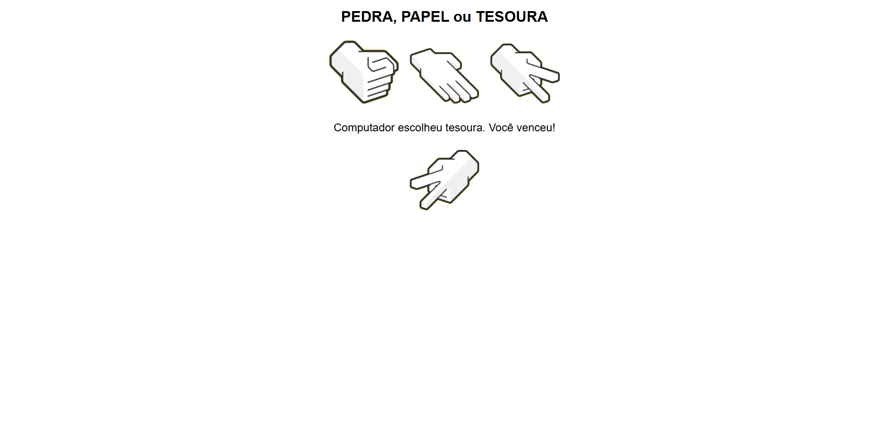

# Pedra, Papel e Tesoura (Jokempo)
# AAAAA
## AAAAA
### AAAAA

Este é um jogo simples desenvolvido em **HTML**, **CSS** e **JavaScript** para jogar 
Pedra, Papel e Tesoura contra a máquina.

## O que foi utilizado:    
- **HTML**: Estrutura básica do site.    
- **CSS**: Estilo do site (deixa bonitinho).    
- **JavaScript**: Lógica do jogo e como ele interage com o usuário.
## Sobre o desenvolvimento:    
Posso considerar o HTML e o CSS a parte mais fácil desse código já que foi apenas importar as imagens e colocar as configurações padrão de um site. Já o JavaScript foi bem mais difícil, já que sabia bem pouco de sua lógica, então boa parte dele foi feita com base de pesquisas realizadas no momento.

## Observações:    
Esse jogo foi feito para melhorar minhas habilidades em desenvolvimento web (que não são das melhores), então não espere muito.

## Imagem do jogo:

Obrigado e até mais, terráqueos! 🖖🏻